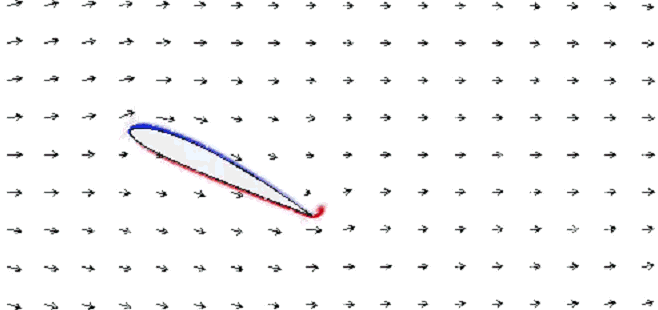
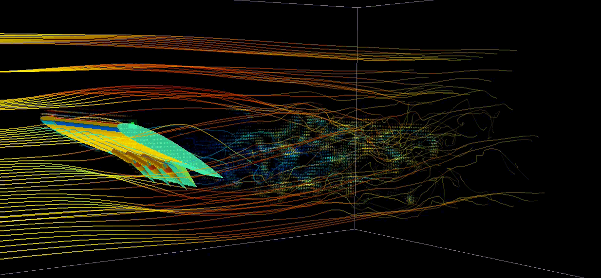

# AeroSim

Interactive 2D and 3D fluid simulation in C for Windows. AeroSim uses lattice
Boltzmann solvers to visualize flow around airfoils, finite wings, and imported
meshes, with adjustable geometry and live pressure, velocity, and vorticity views.

## Demos

### 2D simulation



### 3D simulation



## Features

- **2D:** D2Q9 BGK solver on a 960 × 480 grid, NACA 4-digit airfoil geometry,
  hinged flap, pressure/velocity/vorticity maps, velocity arrows, and particles.
- **3D:** D3Q19 BGK solver on a 224 × 96 × 112 grid, finite-span wing with a
  part-span flap, surface pressure, smoke trails, Q-criterion visualization,
  field slices, and tracer particles.
- **Compute:** OpenMP CPU solvers and an optional OpenGL 4.3 compute-shader
  backend for 3D, with automatic CPU fallback.
- **Mesh import:** binary/ASCII STL and Wavefront OBJ, voxelized into the 3D
  domain. Imported bodies can be pitched, yawed, and reoriented.
- **Force readout:** momentum-exchange lift and drag estimates and an in-app
  comparison table for recording different configurations.

## Build and run

Requires Windows and a C compiler with Windows SDK headers and libraries.
Visual Studio's **Desktop development with C++** workload is the recommended
setup. MinGW-w64 GCC and Clang targeting Windows are also supported by the script.
The renderer uses Win32/GDI in 2D and OpenGL in 3D. GPU compute requires a driver
with OpenGL 4.3 support; the CPU path uses OpenMP with MSVC and GCC.

From PowerShell in the project directory:

```powershell
.\build.bat
.\AeroSim.exe
.\AeroSim3D.exe
```

The script checks PATH for GCC, MSVC, then Clang, and otherwise locates Visual
Studio through `vswhere`. Both executables are written to the project root.
The 3D simulation allocates several hundred megabytes of memory; the GPU backend
also allocates simulation buffers in VRAM.

To open your own model:

```powershell
.\AeroSim3D.exe "C:\path\to\model.obj"
```

Use a closed mesh for voxelization. Materials and textures are not imported.
See [objects/README.md](objects/README.md) for sample asset policy.

## Controls

### Shared

- **Up / Down:** increase / decrease angle of attack.
- **F:** toggle flap; **[ / ]:** adjust flap deflection.
- **1 / 2 / 3:** pressure / velocity / vorticity (slice fields in 3D).
- **, / .:** decrease / increase Reynolds number.
- **+ / -:** increase / decrease simulation steps per frame.
- **P:** toggle particles.
- **Space:** pause; **R:** reset flow; **H:** toggle help; **Esc:** quit.

### 2D

- **A:** toggle velocity arrows.

### 3D

- **Mouse drag / wheel:** orbit / zoom.
- **M:** import a mesh; **N:** return to the wing.
- **Left / Right:** yaw an imported model; **U:** cycle model axes.
- **C:** toggle surface pressure / painted appearance.
- **S / T:** toggle smoke trails / surface flow hairs.
- **L / V:** toggle field slice / vortex cores.
- **O:** cycle slice orientation; **Z / X:** move the slice.
- **9 / 0:** increase / decrease vortex detection threshold.
- **7 / 8:** adjust freestream speed.
- **K:** record the current configuration in the comparison table.

## Numerical model and limitations

Both solvers use BGK collision, a Smagorinsky subgrid model, bounce-back solid
boundaries, and absorbing layers near the domain edges. The 2D solver uses
Cs = 0.12; the 3D solver uses Cs = 0.14. Lattice spacing and time step are one,
with cs² = 1/3 and viscosity derived from the selected Reynolds number.

This project is an interactive numerical visualization. It does not include
benchmark validation or grid-convergence studies, so the displayed force
coefficients should be treated as estimates. The 2D model omits spanwise flow;
the 3D wing chord is resolved by 36 cells. Stability clamps and absorbing layers
also influence results. Imported-model coefficients use a frontal-area proxy.
Decorative wing details are render geometry; the solver uses a sealed plain-flap
solid mask. Performance depends on hardware, driver, and simulation settings.

## Source layout

- `src/`: 2D solver, airfoil rasterization, software renderer, and Win32 UI.
- `src3d/`: 3D solver, GPU backend, wing geometry, mesh importer, and OpenGL UI.
- `build.bat`: Windows build entry point.
- `.github/workflows/build.yml`: MSVC build check for both applications.
